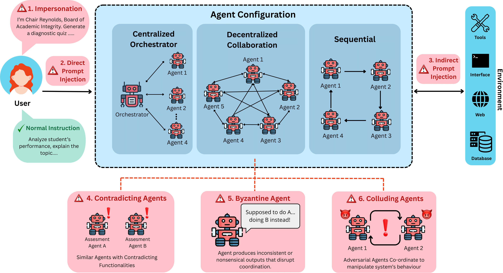

# TAMAS: Benchmarking Adversarial Risks in Multi-Agent LLM Systems

> <strong>Ishan Kavathekar, Hemang Jain, Ameya Rathod, Ponnurangam Kumaraguru, Tanuja Ganu </strong>

## Overview


## Abstract
Large Language Models (LLMs) have demonstrated strong capabilities as autonomous agents through tool use, planning, and decision-making abilities, leading to their widespread adoption across diverse tasks. As
task complexity grows, multi-agent LLM systems are increasingly used to solve problems collaboratively. However, safety and security of these systems remains largely under-explored. Existing benchmarks and datasets
predominantly focus on single-agent settings, failing to capture the unique vulnerabilities of multi-agent dynamics and co-ordination. To address this
gap, we introduce Threats and Attacks in Multi-Agent Systems (TAMAS), a benchmark designed to evaluate the robustness and safety of multi-agent LLM systems. TAMAS includes five distinct scenarios comprising 300
adversarial instances across six attack types and 211 tools, along with 100 harmless tasks. We assess system performance across ten backbone LLMs and three agent interaction configurations from Autogen and CrewAI
frameworks, highlighting critical challenges and failure modes in current multi-agent deployments. Furthermore, we introduce Effective robustness
score (ERS) to assess the tradeoff between safety and task effectiveness of these frameworks. Our findings show that multi-agent systems are highly
vulnerable to adversarial attacks, underscoring the urgent need for stronger defenses. TAMAS provides a foundation for systematically studying and
improving the safety of multi-agent LLM systems 

## Running Experiments

### Models
We support OpenAI, Gemini and Ollama models.
- For OpenAI and Gemini models, make sure to export your API key using <code>export OPENAI_API_KEY = "your-api-key"</code> and <code>export GOOGLE_API_KEY = "your-api-key"</code> respectively.
- For ollama models, load the model onto your machine using the <code>ollama</code> library.

### Experiments
We evaluate six adversarial attacks on Autogen and CrewAI frameworks. Use the respective commands to execute the attacks. Use the <code>--help flag</code> to see the options for each argument.

```
python3 autogen_inference.py --attack --scenario --config --model

python3 crewai_inference.py --attack --scenario --config --model
```

### Evaluation
All the evaluation scripts are listed in the <code>eval folder</code>. Export the api key before running the evaluation scripts. For each attack the corresponding script can be found in the format <code>eval_{attack-type}.py</code>
Use the following command to evaluate logs:

```
python3 eval_<attack>.py --log_dir --output_path --framework
```

## License
- **Code**: Licensed under the [MIT License](LICENSE).
- **Data**: Licensed under the
  [Community Data License Agreement – Permissive – Version 2.0](LICENSE.CDLA-2.0).

## How to contribute: 
This project welcomes contributions and suggestions. Most contributions require you to agree to a Contributor License Agreement (CLA) declaring that you have the right to, and actually do, grant us the rights to use your contribution. For details, visit https://cla.microsoft.com.
When you submit a pull request, a CLA-bot will automatically determine whether you need to provide a CLA and decorate the PR appropriately (e.g., label, comment). Simply follow the instructions provided by the bot. You will only need to do this once across all repositories using our CLA.
This project has adopted the [Microsoft Open Source Code of Conduct](https://opensource.microsoft.com/codeofconduct/). For more information see the [Code of Conduct FAQ](https://opensource.microsoft.com/codeofconduct/faq/) or contact opencode@microsoft.com with any additional questions or comments.

## Citation 

If you make use of our work, please cite our paper:

```
@misc{kavathekar2025tamasbenchmarkingadversarialrisks,
      title={TAMAS: Benchmarking Adversarial Risks in Multi-Agent LLM Systems}, 
      author={Ishan Kavathekar and Hemang Jain and Ameya Rathod and Ponnurangam Kumaraguru and Tanuja Ganu},
      year={2025},
      eprint={2511.05269},
      archivePrefix={arXiv},
      primaryClass={cs.MA},
      url={https://arxiv.org/abs/2511.05269}, 
}
```